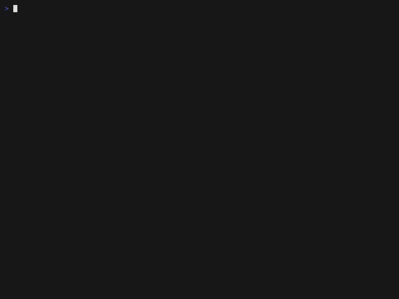

# bashquest



`bashquest` is an interactive shell training environment in the spirit of "capture-the-flag" competitions.
It guides the user through a series of challenges designed to teach and test basic and intermediate shell skills.

For each challenge, `bashquest` populates the workspace with some items (files and directories), and prints the request for the challenge.
The user is required to perform the necessary operation to accomplish with the request.

## Features

- Step-by-step challenges using standard Unix commands (`ls`, `cat`, `echo`, `mkdir`, `rmdir`, etc.).
- Support for multiple, independent quests into dedicated workspaces.
- Persistent state that keeps track of passed challenges.
- Encrypted storage to prevent cheating (secret key can be changed to support installation as super users).
- Plugin-based architecture for easy addition of new challenges.
- Both capture-the-flag and "put-the-flag" style challenges.
- Currently ships with exercises about relative and absolute path, file manipulation, and command-line tricks.

Anti-cheating measures are not meant to be robust against skilled, motivated users (on the other hand, all the stuff is available locally, including the secret key for personal usage), but should be enough to discourage cheating from beginners.

## Installation and usage

The program requires Python 3.11 or more recent.

The program was tested on Debian/Ubuntu Linux and MacOS.

Clone the repository:

```bash
git clone https://github.com/toolleeo/bashquest.git
cd bashquest
```

OPTIONAL: Create the configuration directory `.config/bashquest`.
Copy `challenges.json` to the configuration directory.
The file specifies the list and the order of the challenges that are proposed to the user.

## Main commands

### Start a new quest

Start a new session from scratch with:

```
python bashquest.py start
```

This command will create the `workspace` directory in the current directory.
The name of the workspace can be set by the user; see the options of the command.

### Submit the flag

Submit the flag of the current challenge:

```
python bashquest.py submit [flag]
```

NOTE: the flag to submit is a string contained somehwere in the workspace populated by the challenge, NOT the command that is required to retrieve the flag itself.

The flag is not necessary in case of "put-the-flag" challenges, i.e., when the user is required to create/put something in the workspace. Just do "submit".

### Print the list of challenges

List the available challenges:

```
python bashquest.py list
```

### Set the current challenge

Move to another challenge:

```
python bashquest.py goto <number>
```

Everytime a challenge is set using `goto`, the setup of the challenge itself (directories, files, etc.) can be different - typically randomly generated.

The `--seed` option allows to set a seed for the random number generator, so that the same setup can be reused.

The text of the current challenge can be printed anytime with:

```
python bashquest.py challenge
```

### Working with (different) workspaces

A workspace is a directory created with the `start` command, which contains the hidden directory `.bashquest`, which in turns contains the state of the current quest.

Start a new quest in the desired workspace:

```
python bashquest.py start <name/path of the workspace>
```

Change the active workspace, specifying its path:

```
python bashquest.py use <path>
```

Return the absolute path of the current workspace:

```
python bashquest.py workspace
```

To conclude the active quest (this removes the quest directory):

```
python bashquest.py done
```
